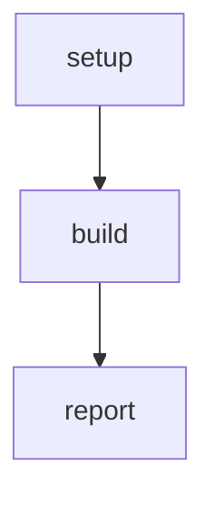

# Simple Pipeline

A basic linear workflow for testing.

# Flow



# Steps

## setup

```bash
echo "Setting up workspace"
```

## build

```bash
echo "Building project"
```

## report

```bash
echo "Build complete"
```
