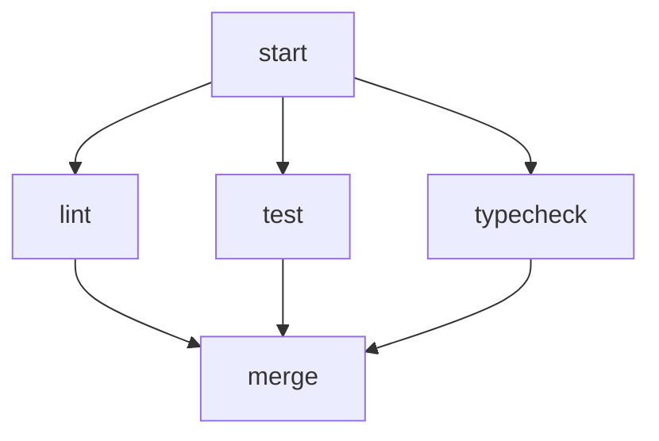

# Parallel Workflow

Tests fan-out and fan-in.

# Flow



# Steps

## start

```bash
echo "Starting"
```

## lint

```bash
echo "Linting"
```

## test

```bash
echo "Testing"
```

## typecheck

```bash
echo "Type checking"
```

## merge

```bash
echo "All checks complete"
```
