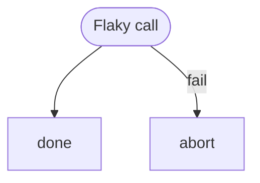

# Step Retry Fixture

Tests intrinsic step-level retry: the `flaky` step fails twice then succeeds
on the third attempt, using a counter file as persistent state.

# Flow



# Steps

## flaky

```config
retry:
  max: 3
```

```bash
COUNTER="$MARKFLOW_RUNDIR/flaky-counter"
n=0
if [ -f "$COUNTER" ]; then n=$(cat "$COUNTER"); fi
n=$((n + 1))
echo "$n" > "$COUNTER"
if [ "$n" -lt 3 ]; then
  echo "attempt $n failing" >&2
  exit 1
fi
echo "attempt $n succeeded"
```

## done

```bash
echo "all good"
```

## abort

```bash
echo "retries exhausted" >&2
exit 1
```
