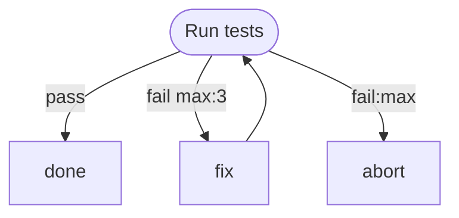

# Retry Workflow

Tests retry logic with max:N and :max handler.

# Flow



# Steps

## test

```bash
echo "Running tests"
```

## fix

```bash
echo "Attempting fix"
```

## done

```bash
echo "All tests passed"
```

## abort

```bash
echo "Giving up after max retries" >&2
exit 1
```
