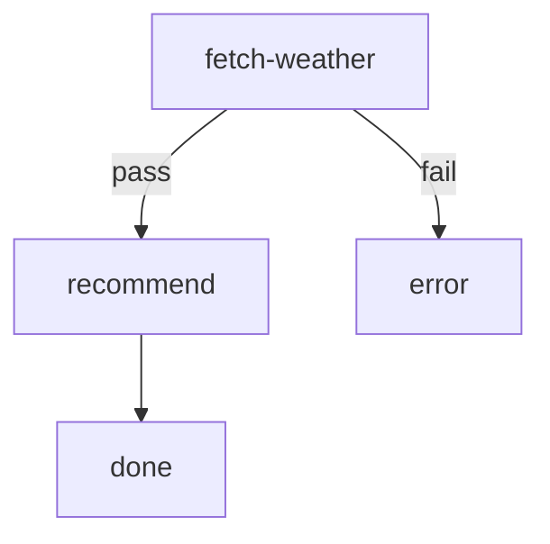

# Dog Walk Weather Advisor

Takes a `city` input, fetches current weather from the free
[wttr.in](https://wttr.in) JSON API, then asks Claude to produce a one-sentence
recommendation about whether it is good weather to walk a dog.

Requires `curl` and `jq` on `PATH`.

# Inputs

- `city` (required): Name of the city to check the weather for (e.g. `Paris`, `New York`, `Tokyo`). Spaces are fine — they will be URL-encoded before the API call.

# Flow



# Steps

## fetch-weather

Fetch the current weather for `{{ GLOBAL.city }}` (passed in as the `city`
input) from wttr.in and publish the relevant fields on `GLOBAL` so the agent
step can read them via `{{ GLOBAL.* }}`.

```bash
set -euo pipefail

CITY="${city:?city input is required}"

# URL-encode the city name so multi-word cities work.
ENCODED=$(jq -rn --arg c "$CITY" '$c|@uri')

echo "Fetching weather for: $CITY"

if ! curl -fsSL "https://wttr.in/${ENCODED}?format=j1" -o weather.json; then
  echo "RESULT: $(jq -nc --arg c "$CITY" '{edge:"fail", summary:("weather fetch failed for " + $c)}')"
  exit 1
fi

# Pull the fields we care about from the current conditions block.
TEMP_C=$(jq -r '.current_condition[0].temp_C'          weather.json)
FEELS_C=$(jq -r '.current_condition[0].FeelsLikeC'     weather.json)
DESC=$(jq   -r '.current_condition[0].weatherDesc[0].value' weather.json)
PRECIP_MM=$(jq -r '.current_condition[0].precipMM'     weather.json)
WIND_KPH=$(jq  -r '.current_condition[0].windspeedKmph' weather.json)
HUMIDITY=$(jq  -r '.current_condition[0].humidity'     weather.json)

echo "Weather: ${DESC}, ${TEMP_C}°C (feels ${FEELS_C}°C), wind ${WIND_KPH} kph, precip ${PRECIP_MM} mm"

# Publish everything downstream steps will need on GLOBAL.
echo "GLOBAL: $(jq -nc \
  --arg city       "$CITY" \
  --arg desc       "$DESC" \
  --arg temp_c     "$TEMP_C" \
  --arg feels_c    "$FEELS_C" \
  --arg precip_mm  "$PRECIP_MM" \
  --arg wind_kph   "$WIND_KPH" \
  --arg humidity   "$HUMIDITY" \
  '{city:$city, desc:$desc, temp_c:$temp_c, feels_c:$feels_c, precip_mm:$precip_mm, wind_kph:$wind_kph, humidity:$humidity}')"

echo "RESULT: $(jq -nc --arg c "$CITY" --arg d "$DESC" '{edge:"pass", summary:("fetched weather for " + $c + ": " + $d)}')"
```

## recommend

```config
agent: claude
flags:
  - --model
  - haiku
  - --dangerously-skip-permissions
```

You are a concise assistant. Given the current weather conditions below, write
**exactly one sentence** recommending whether it is good weather to walk a dog
in **{{ GLOBAL.city }}** right now, and briefly why.

Current conditions:

- Description: {{ GLOBAL.desc }}
- Temperature: {{ GLOBAL.temp_c }}°C (feels like {{ GLOBAL.feels_c }}°C)
- Precipitation: {{ GLOBAL.precip_mm }} mm
- Wind: {{ GLOBAL.wind_kph }} kph
- Humidity: {{ GLOBAL.humidity }}%

Guidelines:
- One sentence. No preamble, no bullet points, no markdown headers.
- Start with a clear verdict ("Yes", "No", or "Maybe").
- Mention one or two of the weather factors above as your reason.

Emit the recommendation on a LOCAL sentinel so the next step can print it.
The final line of your output must be of the form:
`LOCAL: {"recommendation": "<your one sentence here>"}`

## done

Print the recommendation with a small header naming the city.

```bash
CITY=$(jq -r '.city' <<< "$GLOBAL")
REC=$(jq -r '.recommend.local.recommendation // "(no recommendation produced)"' <<< "$STEPS")

printf '\n— Dog walk forecast for %s —\n%s\n\n' "$CITY" "$REC"
```

## error

```bash
echo "Could not produce a dog-walk recommendation (weather fetch failed)." >&2
exit 1
```
