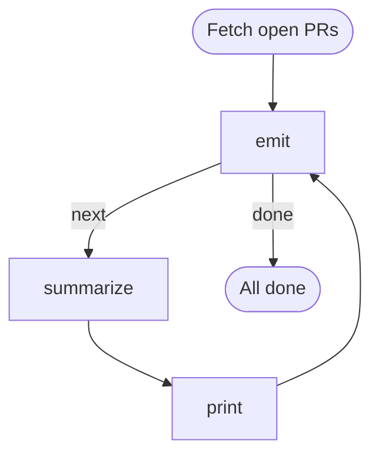

# Open PR Review Summaries

Iterate over every open GitHub pull request assigned to (or authored by) the
current user, ask an agent to produce a one-paragraph review summary for each,
and print the summary as soon as it is generated.

This uses the **emitter pattern**: a single step owns the cached PR list,
keeps its cursor in `LOCAL`, and publishes the current PR into `GLOBAL` so
downstream steps read it as `{{ GLOBAL.pr.* }}` without knowing about the
collection. Summaries are printed one at a time because each agent step's
stdout streams into the run log the moment it finishes (before the loop
advances to the next PR).

Requires `gh` (authenticated), `jq`, and `jo` on `PATH`.

# Inputs

- `author` (string, default: `@me`) — GitHub search qualifier for the PR author.
  Set to `@me` for your own PRs, or a username to review someone else's.
- `limit` (number, default: `50`) — maximum number of PRs to fetch.

# Flow



# Steps

## fetch

Fetch all open PRs once into the run workdir. We grab enough metadata
(title, body, diff stats, files, author, URL) that the summarizer can work
without additional API calls.

```bash
gh pr list \
  --state open \
  --author "{{ INPUTS.author }}" \
  --limit {{ INPUTS.limit }} \
  --json number,title,body,author,url,headRefName,baseRefName,additions,deletions,changedFiles,files,repository \
  > prs.json

TOTAL=$(jq length prs.json)
echo "Found $TOTAL open PR(s) for {{ INPUTS.author }}."
echo "GLOBAL: $(jo total=$TOTAL)"
```

## emit

Emitter: advances a cursor in `LOCAL` and publishes the current PR onto
`GLOBAL.pr`. Routes to `done` when the list is exhausted.

```bash
CURSOR=$(jq -r '.cursor // -1' <<< "$LOCAL")
NEXT=$((CURSOR + 1))
TOTAL=$(jq length prs.json)

if [ "$NEXT" -ge "$TOTAL" ]; then
  echo "LOCAL: $(jo total=$TOTAL cursor=$CURSOR)"
  echo "RESULT: $(jo edge=done)"
  exit 0
fi

PR=$(jq -c ".[$NEXT]" prs.json)
NUMBER=$(jq -r ".[$NEXT].number" prs.json)
TITLE=$(jq -r ".[$NEXT].title" prs.json)

echo "[$((NEXT + 1))/$TOTAL] #$NUMBER — $TITLE"
echo "LOCAL: $(jo cursor=$NEXT)"
echo "GLOBAL: $(jo pr="$PR")"
echo "RESULT: $(jo edge=next)"
```

## summarize

Ask the agent to write a single-paragraph review summary for the current PR.
The prompt receives the PR metadata via Liquid-rendered `GLOBAL.pr`. The
agent is instructed to emit the paragraph as its `LOCAL.summary` so the next
step can print it verbatim.

```config
agent: claude
flags:
  - --model
  - sonnet
```

You are reviewing an open GitHub pull request. Write **one concise paragraph**
(4–7 sentences) summarising what the PR does, the apparent approach, any
noteworthy risks or concerns, and an overall impression. Do not use bullet
lists or headings — prose only.

**Repository:** {{ GLOBAL.pr.repository.nameWithOwner | default: GLOBAL.pr.url }}
**PR #{{ GLOBAL.pr.number }}:** {{ GLOBAL.pr.title }}
**Author:** {{ GLOBAL.pr.author.login }}
**Branch:** `{{ GLOBAL.pr.headRefName }}` → `{{ GLOBAL.pr.baseRefName }}`
**Size:** +{{ GLOBAL.pr.additions }} / -{{ GLOBAL.pr.deletions }} across {{ GLOBAL.pr.changedFiles }} file(s)
**URL:** {{ GLOBAL.pr.url }}

**Body:**
{{ GLOBAL.pr.body | default: "(no description)" }}

**Changed files:**
{{ GLOBAL.pr.files | list: "path" }}

When you are done, emit exactly one line of the form:

`LOCAL: {"summary": "<your one-paragraph review as a single JSON string>"}`

so the workflow can capture and print it.

## print

Print the summary the agent just produced. Because this step runs
immediately after `summarize` (and before `emit` advances the cursor), the
user sees each paragraph streamed out one-at-a-time as the loop progresses.

```bash
NUMBER=$(jq -r '.pr.number' <<< "$GLOBAL")
TITLE=$(jq -r '.pr.title' <<< "$GLOBAL")
URL=$(jq -r '.pr.url' <<< "$GLOBAL")
SUMMARY=$(jq -r '.summarize.local.summary // "(agent did not emit a summary)"' <<< "$STEPS")

echo ""
echo "──────────────────────────────────────────────────────────────"
echo "PR #$NUMBER — $TITLE"
echo "$URL"
echo "──────────────────────────────────────────────────────────────"
echo "$SUMMARY"
echo ""
```

## done

```bash
TOTAL=$(jq -r '.emit.local.total // "?"' <<< "$STEPS")
echo "Reviewed $TOTAL open PR(s)."
```
