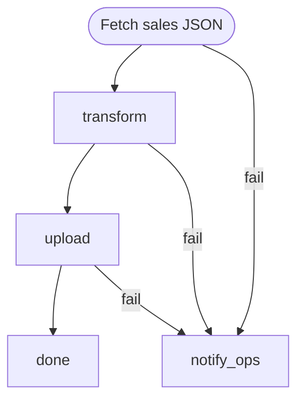

# Daily Sales Sync

Fetch the daily sales feed from the upstream API, transform it with a Python
script, and upload the result to S3. If the fetch never succeeds after its
retry budget, notify ops via `mail` instead of silently aborting.

The workflow uses **step-level retries** (`retry:` in a `config` block) for
the flaky HTTP fetch — this keeps retries in place with exponential backoff
without polluting the graph with a retry loop. The final `notify_ops` step
is wired as the `fail` edge of `fetch_sales` so that it only runs when the
retry budget is exhausted.

Requires `curl`, `python3`, `aws` (for `aws s3 cp`), and `mail` on `PATH`.

```config
max_retries_default: 0
```

# Inputs

- `api_url` (string, default `https://api.example.com/sales.json`) — upstream JSON feed.
- `s3_dest` (string, default `s3://example-sales/daily/sales.json`) — destination object URL.
- `ops_email` (string, default `ops@example.com`) — recipient for failure notifications.

# Flow



# Steps

## fetch_sales

Download the daily sales JSON. The upstream API is known to flake under
load, so we retry up to 5 times with exponential backoff (1s → 2s → 4s →
8s → 16s, with jitter). The payload is written to the run directory so
downstream steps can pick it up from a stable location.

```config
timeout: 2m
retry:
  max: 5
  delay: 1s
  backoff: exponential
  jitter: true
```

```bash
set -euo pipefail

OUT="$MARKFLOW_RUNDIR/sales.json"

# --fail turns HTTP >=400 into a non-zero exit so retry/fail routing kicks in.
# --show-error + --silent keeps logs readable while still surfacing errors.
curl --fail --show-error --silent --location \
  --max-time 60 \
  -o "$OUT" \
  "{{ INPUTS.api_url }}"

BYTES=$(wc -c < "$OUT" | tr -d ' ')
echo "Downloaded $BYTES bytes to $OUT"
echo "LOCAL: $(printf '{"path":"%s","bytes":%s}' "$OUT" "$BYTES")"
```

## transform

Run the Python transformer over the raw JSON. The script is inlined here
so the workflow file is self-contained; swap the heredoc for
`python3 path/to/transform.py "$IN" "$OUT"` if you already have a script on
disk.

```bash
set -euo pipefail

IN=$(jq -r '.fetch_sales.local.path' <<< "$STEPS")
OUT="$MARKFLOW_RUNDIR/sales.transformed.json"

python3 - "$IN" "$OUT" <<'PY'
import json, sys, datetime

src, dst = sys.argv[1], sys.argv[2]
with open(src) as f:
    raw = json.load(f)

# Example transform — adapt to the real schema.
records = raw.get("records", raw if isinstance(raw, list) else [])
out = {
    "generated_at": datetime.datetime.utcnow().isoformat() + "Z",
    "count": len(records),
    "records": records,
}

with open(dst, "w") as f:
    json.dump(out, f, separators=(",", ":"))

print(f"Transformed {len(records)} records -> {dst}")
PY

echo "LOCAL: $(printf '{"path":"%s"}' "$OUT")"
```

## upload

Push the transformed file to S3. `aws s3 cp` exits non-zero on failure,
which routes to `notify_ops` via the `fail` edge.

```config
timeout: 2m
```

```bash
set -euo pipefail

SRC=$(jq -r '.transform.local.path' <<< "$STEPS")
DEST="{{ INPUTS.s3_dest }}"

aws s3 cp "$SRC" "$DEST"
echo "Uploaded $SRC -> $DEST"
```

## done

Terminal success step — prints a one-line summary for the run log.

```bash
echo "Daily sales sync complete: uploaded to {{ INPUTS.s3_dest }}"
```

## notify_ops

Failure handler. Reached when `fetch_sales` exhausts its retry budget, or
when `transform`/`upload` fail. Sends a short notification via `mail(1)`
and exits non-zero so the overall run is recorded as failed.

```bash
set -euo pipefail

SUBJECT="[markflow] daily sales sync failed ($(date -u +%Y-%m-%dT%H:%M:%SZ))"
BODY_FILE="$MARKFLOW_RUNDIR/notify-body.txt"

{
  echo "The daily sales sync workflow failed."
  echo
  echo "Run directory: $MARKFLOW_RUNDIR"
  echo "API:           {{ INPUTS.api_url }}"
  echo "Destination:   {{ INPUTS.s3_dest }}"
  echo
  echo "Check events.jsonl and output/ for per-step stdout/stderr."
} > "$BODY_FILE"

mail -s "$SUBJECT" "{{ INPUTS.ops_email }}" < "$BODY_FILE"
echo "Notified {{ INPUTS.ops_email }}" >&2
exit 1
```
