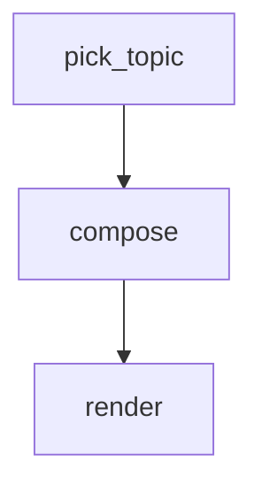

# Haiku Composer

Minimal linear pipeline: pick a topic, have an agent write a haiku about it, render
the result. Three steps, one edge between each. Demonstrates the top-level `config`
block, `GLOBAL` publication from a script, `LOCAL` publication from an agent, and
cross-step read via `STEPS`.

Requires `jq` on `PATH`.

```config
agent: claude
flags:
  - --model
  - haiku
```

# Flow



# Steps

## pick_topic

Pick a topic at random from a short list and publish it so downstream steps can
read it as `{{ GLOBAL.topic }}`.

```bash
TOPICS=("autumn leaves" "morning coffee" "a sleeping cat" "rain on rooftop" "first snow")
TOPIC="${TOPICS[$RANDOM % ${#TOPICS[@]}]}"

echo "Topic: $TOPIC"
echo "GLOBAL: $(jq -nc --arg t "$TOPIC" '{topic:$t}')"
```

## compose

Write a traditional haiku about **{{ GLOBAL.topic }}**. Three lines, 5-7-5
syllable structure, no title, no commentary.

Emit the haiku on a LOCAL sentinel so the next step can pick it up. Use `\n`
inside the JSON string to preserve line breaks — the line must be of the form
`LOCAL: {"haiku": "line1\nline2\nline3"}`.

## render

Print the haiku with a small header naming the topic.

```bash
TOPIC=$(jq -r '.topic' <<< "$GLOBAL")
HAIKU=$(jq -r '.compose.local.haiku // "(no haiku)"' <<< "$STEPS")

printf '\n— %s —\n%s\n\n' "$TOPIC" "$HAIKU"
```
