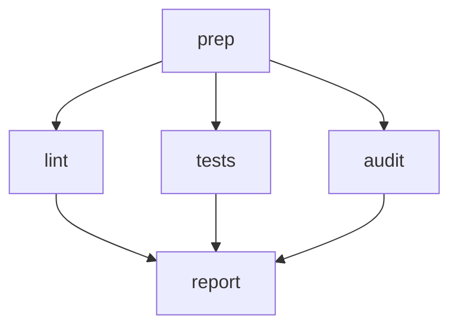

# Release Readiness

Run three independent checks in parallel against a release candidate, then join
their results into a single report. Demonstrates **fan-out** (multiple unlabeled
edges from a node run concurrently), **fan-in** (a node with multiple incoming
edges waits for all upstream to complete), and cross-step aggregation via
`STEPS`.

Requires `jq`.

# Flow



# Steps

## prep

Publish the git SHA once so every downstream check annotates its output with the
same value.

```bash
SHA=$(git rev-parse --short HEAD 2>/dev/null || echo "unknown")
echo "Checking SHA: $SHA"
echo "GLOBAL: $(jq -nc --arg s "$SHA" '{sha:$s}')"
```

## lint

```bash
if npm run lint --silent; then
  echo "RESULT: ok | lint clean"
else
  echo "RESULT: ok | lint failed"
fi
```

## tests

```bash
if npm test --silent; then
  echo "RESULT: ok | tests passed"
else
  echo "RESULT: ok | tests failed"
fi
```

## audit

```bash
COUNT=$(npm audit --json 2>/dev/null | jq -r '.metadata.vulnerabilities.total // 0')
echo "RESULT: ok | audit: $COUNT vulns"
```

## report

Aggregate each upstream step's `RESULT.summary` into a markdown report.
Runs only after `lint`, `tests`, and `audit` have all completed.

```bash
SHA=$(jq -r '.sha' <<< "$GLOBAL")
LINT=$(jq -r '.lint.summary' <<< "$STEPS")
TEST=$(jq -r '.tests.summary' <<< "$STEPS")
AUDIT=$(jq -r '.audit.summary' <<< "$STEPS")

cat <<EOF
# Release readiness — $SHA

- Lint: $LINT
- Tests: $TEST
- Audit: $AUDIT
EOF
```
