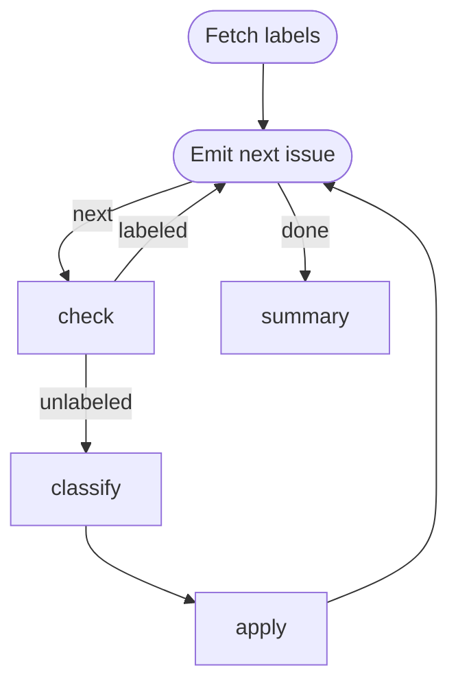

# Issue Triage Loop

Label un-triaged GitHub issues one at a time. Demonstrates the **emitter
pattern**: a single step owns a cached list, keeps its cursor in `LOCAL` (its
own self-reentry memory), and publishes the current item into `GLOBAL` so
downstream steps read it as `{{ GLOBAL.item.* }}` without knowing about the
collection.

Note the stadium shape on `emit([...])` — it marks the cyclic graph's entry
point so the engine doesn't fall back to "no incoming edges" detection.

Requires `gh` (authenticated), `jq`, and `jo` on `PATH`.

```config
agent: claude
flags:
  - --model
  - haiku
```

# Flow



# Steps

## labels

Fetch the repo's label catalogue once and publish the raw array on `GLOBAL`.
The classifier iterates over it inline via Liquid, so producer and consumer
stay decoupled.

```bash
LABELS=$(gh label list --json name,description)
echo "GLOBAL: $(jq -nc --argjson labels "$LABELS" '{labels: $labels}')"
```

## emit

Fetch the issue list once into the run workdir, hold the cursor in `LOCAL`,
publish the current item to `GLOBAL`. On re-entry via a back-edge, `LOCAL`
carries the prior cursor.

```bash
if [ ! -f issues.json ]; then
  gh issue list --state open --search "no:label" --json number,title,body,labels --limit 50 > issues.json
fi

CURSOR=$(jq -r '.cursor // -1' <<< "$LOCAL")
NEXT=$((CURSOR + 1))
TOTAL=$(jq length issues.json)

if [ "$NEXT" -ge "$TOTAL" ]; then
  echo "LOCAL: $(jo total=$TOTAL)"
  echo "RESULT: $(jo edge=done)"
  exit 0
fi

ITEM=$(jq -c ".[$NEXT]" issues.json)
echo "[$((NEXT + 1))/$TOTAL] #$(jq -r ".[$NEXT].number" issues.json) — $(jq -r ".[$NEXT].title" issues.json)"
echo "LOCAL: $(jo cursor=$NEXT)"
echo "GLOBAL: $(jo item="$ITEM")"
echo "RESULT: $(jo edge=next)"
```

## check

Skip issues that already carry a label; route fresh ones to the classifier.

```bash
ITEM=$(jq -c '.item' <<< "$GLOBAL")

if [ "$(jq '.labels | length' <<< "$ITEM")" -gt 0 ]; then
  echo "Already labeled — skipping."
  echo "RESULT: $(jo edge=labeled)"
else
  echo "RESULT: $(jo edge=unlabeled)"
fi
```

## classify

Classify this GitHub issue into exactly one label from the list below.

**Title:** {{ GLOBAL.item.title }}

**Body:**
{{ GLOBAL.item.body | default: "(no body)" }}

Pick exactly one from:

{{ GLOBAL.labels | list: "name,description" }}

Emit `LOCAL: {"label": "<choice>"}` so the next step can pick it up.

## apply

Apply the classifier's label back to the issue. The issue number comes from
`GLOBAL` (published by `emit`); the label comes from `classify`'s own local
state via the cross-step `STEPS` map.

```bash
NUMBER=$(jq -r '.item.number' <<< "$GLOBAL")
LABEL=$(jq -r '.classify.local.label' <<< "$STEPS")

gh issue edit "$NUMBER" --add-label "$LABEL"
echo "Labeled #$NUMBER as $LABEL."
```

## summary

```bash
echo "Triage complete: $(jq -r '.emit.local.total // "?"' <<< "$STEPS") issue(s) seen."
```
