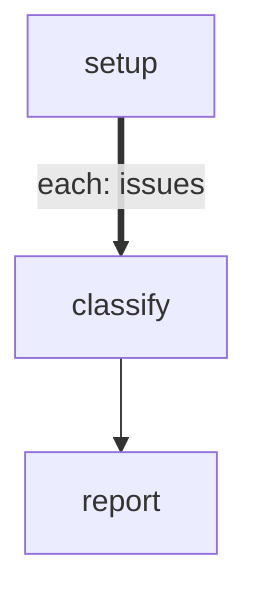

# Issue Classifier

Classifies a list of issues one at a time using an agent step. Demonstrates
forEach with `maxConcurrency: 1` for sequential iteration, an agent step body
with Liquid templating (`{{ ITEM.title }}`, `{{ GLOBAL.labels | list }}`), and
result collection.

This is the recommended pattern for "process a list with an LLM" — replaces the
manual emitter pattern (back-edges + LOCAL cursor) with declarative forEach.

```config
agent: claude
flags:
  - --model
  - haiku
```

# Flow



# Steps

## setup

```config
foreach:
  maxConcurrency: 1
  onItemError: continue
```

```bash
set -euo pipefail

issues='[{"number":101,"title":"Login timeout on mobile","body":"Users report 30s hangs on iOS 17."},{"number":102,"title":"Add dark mode","body":"Feature request for dark theme support."},{"number":103,"title":"Crash on empty input","body":"App crashes when submitting empty form."},{"number":104,"title":"Update dependencies","body":"Several packages are 2 major versions behind."}]'
labels='[{"name":"bug","description":"Something is broken"},{"name":"feature","description":"New functionality request"},{"name":"maintenance","description":"Chores, upgrades, and tech debt"}]'

echo "GLOBAL: {\"labels\": $labels}"
echo "LOCAL: {\"issues\": $issues}"
echo "RESULT: {\"edge\": \"next\", \"summary\": \"4 issues to classify\"}"
```

## classify

Classify this issue into exactly one label from the list below.

**Issue #{{ ITEM.number }}:** {{ ITEM.title }}

**Description:**
{{ ITEM.body | default: "(no description)" }}

**Available labels:**
{{ GLOBAL.labels | list: "name,description" }}

Respond with exactly one label name on a LOCAL line:
LOCAL: {"label": "<your-choice>"}

## report

```bash
set -euo pipefail

results=$(echo "$GLOBAL" | jq -c '.results')
total=$(echo "$results" | jq 'length')
classified=$(echo "$results" | jq '[.[] | select(.ok == true)] | length')

echo "=== Classification Report ==="
echo "$results" | jq -r '.[] | select(.ok == true) | "  #\(.local.label // "unknown") — \(.summary)"'
echo ""
echo "Classified: $classified/$total"
echo "RESULT: {\"edge\": \"next\", \"summary\": \"classified $classified/$total issues\"}"
```
