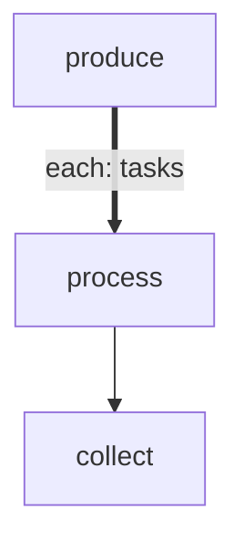

# Batch Processor

Demonstrates forEach with `maxConcurrency` — a source step emits items, the engine
processes them through a body chain with a sliding concurrency window, and a collector
aggregates the results. Uses `onItemError: continue` so all items run even if some fail.

# Flow



# Steps

## produce

```config
foreach:
  maxConcurrency: 2
  onItemError: continue
```

```bash
set -euo pipefail

tasks='[{"name":"alpha","weight":1},{"name":"beta","weight":2},{"name":"gamma","weight":3},{"name":"delta","weight":1},{"name":"epsilon","weight":2},{"name":"zeta","weight":3}]'
count=$(echo "$tasks" | jq 'length')

echo "LOCAL: {\"tasks\": $tasks}"
echo "RESULT: {\"edge\": \"next\", \"summary\": \"produced $count tasks\"}"
```

## process

```config
retry:
  max: 1
  delay: 1s
```

```bash
set -euo pipefail

name=$(echo "$ITEM" | jq -r '.name')
weight=$(echo "$ITEM" | jq -r '.weight')

echo "[$ITEM_INDEX] Processing task: $name (weight=$weight)"
sleep 0.$((weight))

roll=$((RANDOM % 100))
if [ "$roll" -lt 15 ]; then
  echo "[$ITEM_INDEX] Task $name failed (roll=$roll)"
  echo "RESULT: {\"edge\": \"fail\", \"summary\": \"$name failed\"}"
  exit 1
fi

echo "[$ITEM_INDEX] Task $name completed"
echo "LOCAL: {\"name\": \"$name\", \"processed\": true}"
echo "RESULT: {\"edge\": \"next\", \"summary\": \"$name done\"}"
```

## collect

```bash
set -euo pipefail

results=$(echo "$GLOBAL" | jq -c '.results')
total=$(echo "$results" | jq 'length')
ok=$(echo "$results" | jq '[.[] | select(.ok == true)] | length')
failed=$((total - ok))

echo "=== Batch Results ==="
echo "  Total:  $total"
echo "  OK:     $ok"
echo "  Failed: $failed"

echo "$results" | jq -r '.[] | "  [\(.ok | if . then "OK" else "FAIL" end)] \(.summary)"'

echo "RESULT: {\"edge\": \"next\", \"summary\": \"$ok/$total succeeded\"}"
```
