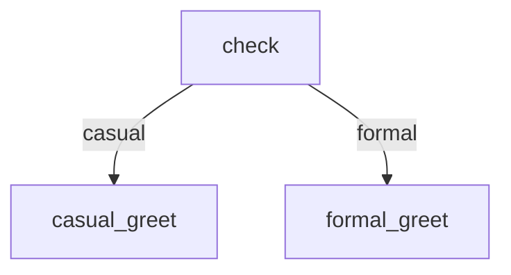

# Greeting Router

Demonstrates declared workflow inputs used in both bash steps (`$NAME` env var)
and agent prompts (`{{ NAME }}` Liquid variable), plus conditional edge routing
based on a step's RESULT.

Run with: `markflow run <file> --input NAME=Alice --input STYLE=formal`

# Inputs

- `NAME` (required): The person to greet
- `STYLE` (default: `casual`): Greeting style — casual or formal

# Flow



# Steps

## check

Route to the appropriate greeting style based on the `$STYLE` input.

```bash
set -euo pipefail

echo "Routing for: $NAME (style=$STYLE)"

if [ "$STYLE" = "formal" ]; then
  echo "RESULT: formal | formal greeting for $NAME"
else
  echo "RESULT: casual | casual greeting for $NAME"
fi
```

## casual_greet

```bash
set -euo pipefail

echo "Hey $NAME! What's up?"
echo "RESULT: next | greeted $NAME casually"
```

## formal_greet

```bash
set -euo pipefail

echo "Good day, $NAME. I hope this message finds you well."
echo "RESULT: next | greeted $NAME formally"
```
