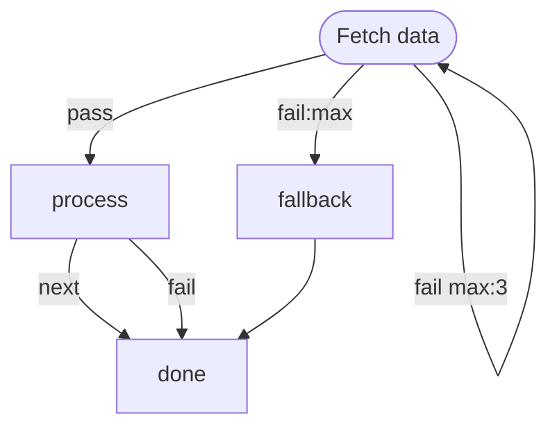

# Resilient Fetch

Demonstrates edge-level retry (`fail max:N` + `fail:max` exhaustion handler)
and per-step timeouts. A fetch step retries up to 3 times on failure, with an
exhaustion path to a fallback. A processing step has a timeout that kills it
if it runs too long.

# Flow



# Steps

## fetch

Simulates a flaky data source that fails ~50% of the time.

```bash
set -euo pipefail

attempt=$((${MARKFLOW_RETRY_COUNT:-0} + 1))
roll=$((RANDOM % 100))
echo "Fetch attempt $attempt: rolled $roll (need >= 50)"

if [ "$roll" -lt 50 ]; then
  echo "RESULT: fail | fetch failed (roll=$roll)"
  exit 1
fi

echo "GLOBAL:"
jq -n '{payload: {items: ["alpha", "beta", "gamma"], source: "api"}}'
echo "RESULT: pass | fetched 3 items"
```

## process

```config
timeout: 3s
```

```bash
set -euo pipefail

items=$(echo "$GLOBAL" | jq -r '.payload.items[]')
count=$(echo "$GLOBAL" | jq '.payload.items | length')

echo "Processing $count items..."
sleep 1

for item in $items; do
  echo "  Processed: $item"
done

echo "RESULT: next | processed $count items"
```

## fallback

```bash
set -euo pipefail

echo "All fetch attempts exhausted. Using cached data."
echo "GLOBAL:"
jq -n '{payload: {items: ["cached-1", "cached-2"], source: "cache"}}'
echo "RESULT: next | fell back to cache"
```

## done

```bash
set -euo pipefail

source=$(echo "$GLOBAL" | jq -r '.payload.source')
count=$(echo "$GLOBAL" | jq '.payload.items | length')

echo "=== Complete ==="
echo "  Source: $source"
echo "  Items:  $count"
echo "RESULT: next | done ($source, $count items)"
```
