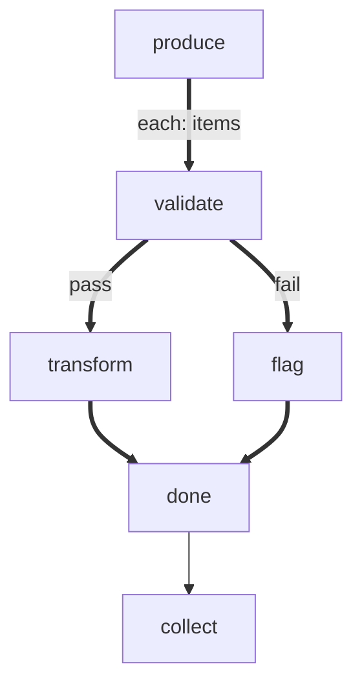

# Validate and Transform

Demonstrates branching within a forEach body. Items are validated, then routed
to different processing paths based on the result. Both paths reconverge at a
merge node before exiting to the collector.

# Flow



# Steps

## produce

```config
foreach:
  maxConcurrency: 3
  onItemError: continue
```

```bash
set -euo pipefail

echo 'LOCAL: {"items": [{"url":"https://a.com","status":200},{"url":"https://b.com","status":404},{"url":"https://c.com","status":200},{"url":"https://d.com","status":500}]}'
echo "RESULT: next | produced 4 URLs to check"
```

## validate

```bash
set -euo pipefail

url=$(echo "$ITEM" | jq -r '.url')
status=$(echo "$ITEM" | jq -r '.status')

if [ "$status" -ge 200 ] && [ "$status" -lt 400 ]; then
  echo "RESULT: pass | $url OK ($status)"
else
  echo "RESULT: fail | $url error ($status)"
fi
```

## transform

```bash
set -euo pipefail

url=$(echo "$ITEM" | jq -r '.url')
echo "LOCAL:"
jq -n --arg u "$url" '{processed: $u, action: "cached"}'
echo "RESULT: next | cached $url"
```

## flag

```bash
set -euo pipefail

url=$(echo "$ITEM" | jq -r '.url')
status=$(echo "$ITEM" | jq -r '.status')
echo "LOCAL:"
jq -n --arg u "$url" --argjson s "$status" '{flagged: $u, status: $s}'
echo "RESULT: next | flagged $url ($status)"
```

## done

```bash
echo "RESULT: next | item done"
```

## collect

```bash
set -euo pipefail

results=$(echo "$GLOBAL" | jq -c '.results')
total=$(echo "$results" | jq 'length')
echo "=== Summary ==="
echo "$results" | jq -r '.[] | "  [\(.itemIndex)] \(.summary)"'
echo "RESULT: next | processed $total URLs"
```
