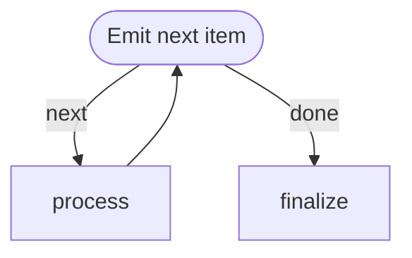
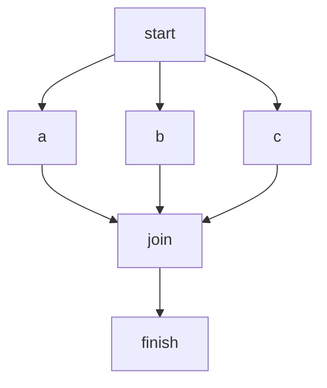
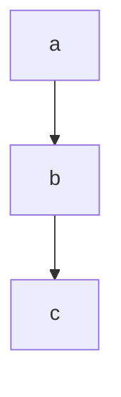
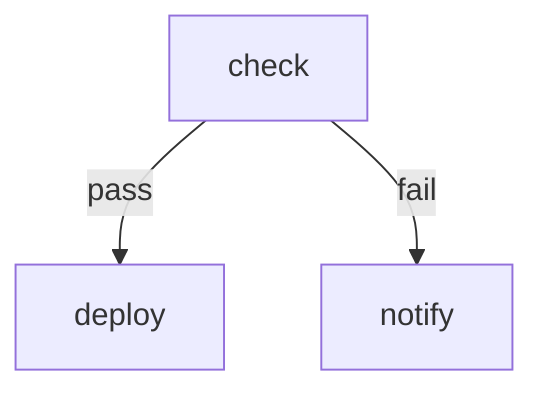
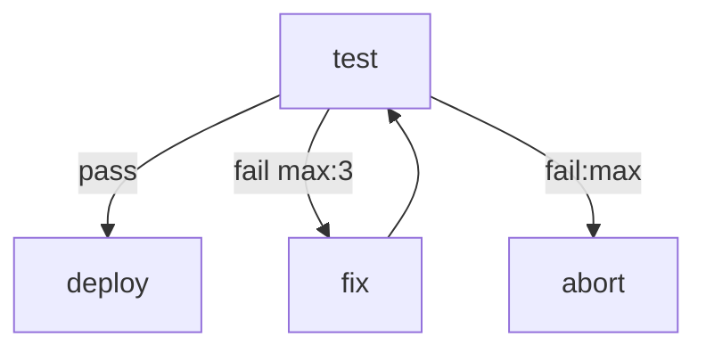

# Mermaid Cheatsheet for markflow

markflow parses a subset of Mermaid's flowchart grammar. Everything here is supported; anything not here probably isn't.

## Diagram header

```mermaid
flowchart TD
```

- `flowchart` or the alias `graph`. Nothing else.
- Direction (`TD`, `LR`, `TB`, `BT`, `RL`) is parsed but ignored by the executor — purely for display.

## Node IDs and labels

A node ID is a plain identifier. Node shape is optional and affects display only (**except** stadium, which marks start nodes in cyclic graphs — see below).

| Syntax | Shape | Notes |
|---|---|---|
| `A` | default rectangle | Most common |
| `A[Label]` | rectangle | Explicit label |
| `A(Label)` | rounded | |
| `A([Label])` | stadium | **Marks a start node** in cyclic graphs |
| `A{Label}` | diamond | |
| `A((Label))` | circle | |
| `A(((Label)))` | double circle | |
| `A[(Label)]` | cylinder | |
| `A[[Label]]` | subroutine | |
| `A{{Label}}` | hexagon | |
| `A[/Label/]`, `A[\Label\]`, `A[/Label\]`, `A[\Label/]` | parallelogram / trapezoid variants | |
| `A>Label]` | asymmetric | |

Multi-word labels must be quoted: `A["Fetch the thing"]`. Only the first occurrence of a node needs its shape — later references can use the bare ID.

## Edges

| Syntax | Meaning |
|---|---|
| `A --> B` | Normal arrow |
| `A --- B` | Open link (no arrow) |
| `A -.-> B` | Dotted arrow |
| `A ==> B` | Thick arrow |
| `A -->|label| B` | Labeled arrow |
| `A -->|label max:N| B` | Labeled edge with retry budget |
| `A -->|label:max| B` | Exhaustion handler edge (paired with `max:N`) |

### Edge labels and routing

- An edge label is an **identifier**. Steps choose an outgoing edge by emitting `RESULT: {"edge": "label"}`.
- Unlabeled edges from a node with multiple outgoing unlabeled edges → **fan-out in parallel**.
- Conventional labels: `pass` / `fail`, `next` / `done`, `labeled` / `unlabeled`, etc. Pick clear names; they show up in logs.
- Non-zero exit code auto-routes to the `fail` edge if one exists; exit 0 auto-routes to a non-`fail` edge.

### Retry annotations

Two edges work together:

```
A -->|fail max:3| B
A -->|fail:max| C
```

- `max:3`: engine may follow this edge up to 3 times on repeated `fail` routes from `A`.
- `fail:max`: followed once the budget is exhausted.
- **Pair them always.** `max:N` with no `:max` halts the workflow on exhaustion. `:max` with no `max:N` is a parse error.
- For "re-try the same step in place" with backoff/jitter (no graph visibility), use the step-level `retry:` policy in a ` ```config ` block instead — see `routing-and-config.md`.

## Start nodes

The engine auto-detects start nodes as **any node with no incoming edges**. This works for DAGs.

For cyclic graphs (loops), the loop target *has* an incoming edge, so auto-detection fails. Mark the entry explicitly with **stadium shape** — `A([Label])` — at its first occurrence:



Once any node carries stadium shape, the "no incoming edges" fallback is disabled and stadium nodes become the complete start set.

## Fan-out / fan-in

- **Fan-out**: multiple outgoing edges from one node execute in parallel (subject to top-level `parallel: false` if you want serial).
- **Fan-in**: a node with multiple incoming edges waits for *all* upstream tokens to complete before running.



Here `start` fans out to three parallel steps; `join` runs once after all three finish.

## Subgraphs

`subgraph NAME ... end` is parsed. Nodes inside are included in the graph normally. Subgraph grouping metadata isn't used by the executor today (display-only / future visualization).

## Common graph shapes

### Linear pipeline


### Branch on result


### Retry with exhaustion handler


### Loop (emitter pattern)

