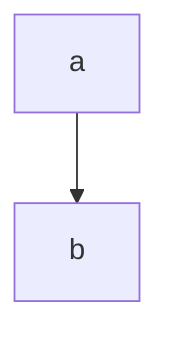

# Workflow File Anatomy

A markflow workflow is a single `.md` file. Sections appear in this exact order; all but the top-level config block are required.

## Required ordering

```
# <Title>                        ← H1, required
<optional prose description>     ← ignored by parser, used as docs

```config                        ← optional, top-level config block
<yaml>
```

# Flow                           ← required; one mermaid block inside


# Steps                          ← required; one ## per node
## a
## b
```

Anything outside this structure is an error.

## Section 1 — Title and description

- The **first H1** is the workflow name. It's used in run listings and as the default workspace directory name.
- Any prose between the H1 and either the optional ` ```config ` block or the `# Flow` heading is a description — ignored by the parser, treated as human-readable docs. Use it freely.

## Section 2 — Optional top-level config block

A fenced ` ```config ` block sitting between the H1 (or description) and `# Flow`. YAML body. Recognized keys:

| Key                   | Type   | Default  | Meaning |
|---|---|---|---|
| `agent`               | string | `claude` | Agent CLI to invoke for agent steps |
| `flags`               | list   | `[]`     | Extra args to pass to the agent CLI |
| `parallel`            | bool   | `true`   | Allow concurrent token execution on fan-out |
| `max_retries_default` | number | unset    | Default retry count for step-level retries |
| `timeout_default`     | string | unset    | Default per-step timeout (e.g., `30s`, `2m`) |

Precedence (lowest → highest): built-in defaults < top-level `config` block < sibling `.workflow.json` < programmatic `options.config`. If both the inline block and a `.workflow.json` are present, the JSON wins and the engine prints a warning.

**`flags` is for extras only.** The engine auto-prepends the non-interactive switch for each agent (`-p` for `claude`/`gemini`, `exec -` for `codex`). Don't duplicate it.

## Section 3 — `# Flow`

Must contain exactly one fenced ` ```mermaid ` block. Only `flowchart` (alias `graph`) is supported. Direction (`TD`, `LR`, …) is accepted but ignored. See `mermaid-cheatsheet.md` for node shapes, edge types, retry annotations.

## Section 4 — `# Steps`

One `## <node_id>` subsection per node referenced in the flow. Heading must match the node ID exactly. Step type is determined by what's inside:

| Content pattern | Step type | Executor |
|---|---|---|
| ` ```bash ` or ` ```sh ` code block | script | `bash` |
| ` ```python ` code block | script | `python3` |
| ` ```js ` or ` ```javascript ` code block | script | `node` |
| Plain prose (no code block) | agent | configured agent CLI |

An unknown code language is a parse error.

A step may start with a ` ```config ` block before its body to override workflow defaults for that step. See `routing-and-config.md`.

## `# Inputs` section (optional)

Appears between the description/config block and `# Flow`. Declares named parameters passed via `--input KEY=VALUE`, `--env <file>`, or the workspace `.env`.

### Grammar

Each input is a Markdown list item matching this exact pattern:

```
- `NAME` (required): description
- `NAME` (optional): description
- `NAME` (default: "value"): description
- `NAME` (default: `value`): description
```

### Rules

- Name **must** be backtick-wrapped. Convention is `UPPER_SNAKE_CASE` but lowercase is accepted.
- Exactly three modifier forms: `(required)`, `(optional)`, `(default: <quoted-value>)`.
- Default values must be quoted with `"..."` or `` `...` ``.
- Separator between modifier and description is `: ` (colon + space). Not `—`, not `-`.
- No type annotations — `(string, default: ...)` is invalid.

### Legal vs illegal

| Legal | Illegal | Why |
|---|---|---|
| `` - `TAG` (default: `auto`): The tag `` | `` - `tag` (string, default: `auto`) — The tag `` | type prefix + em-dash |
| `` - `TOKEN` (required): API token `` | `` - TOKEN (required): API token `` | missing backticks |
| `` - `URL` (default: "https://x"): Endpoint `` | `` - `URL` (default: https://x): Endpoint `` | unquoted default |

### Runtime resolution

Priority (highest first): `--input` flags > `--env <file>` > workspace `.env` > process environment > declared default. Required inputs with no value abort the run.

### In steps

- Script steps: plain env var — `$TAG`, `${TAG}`.
- Agent steps: flat Liquid variable — `{{ TAG }}`. There is NO `INPUTS` namespace.

## Validation rules (partial list)

The parser/validator rejects:

- Missing `# Flow` or `# Steps` section.
- `# Flow` with zero or more than one mermaid block.
- A node referenced in the flow with no matching `## <id>` heading.
- A `## <id>` heading that doesn't appear in the flow.
- Unknown fenced-code language in a step body.
- `label max:N` edge without a paired `label:max` handler.
- `label:max` handler with no corresponding `label max:N`.
- Unknown key in a `config` block.
- `flags:` list containing the agent's non-interactive switch.

## Errors you'll hit most often

1. **"Node X has no matching step"** — add `## X` under `# Steps`, or remove `X` from the flow.
2. **"Retry handler with no budget"** — you wrote `fail:max` but no `fail max:N` edge.
3. **"Undefined template variable"** — an agent step references `{{ GLOBAL.foo }}` or `{{ STEPS.bar.local.baz }}` that no upstream step published. Use `| default:` or fix the producer.
4. **"Unknown code block language"** — you used ` ```shell ` or ` ```ts `. Supported languages: `bash`, `sh`, `python`, `js`, `javascript`.
